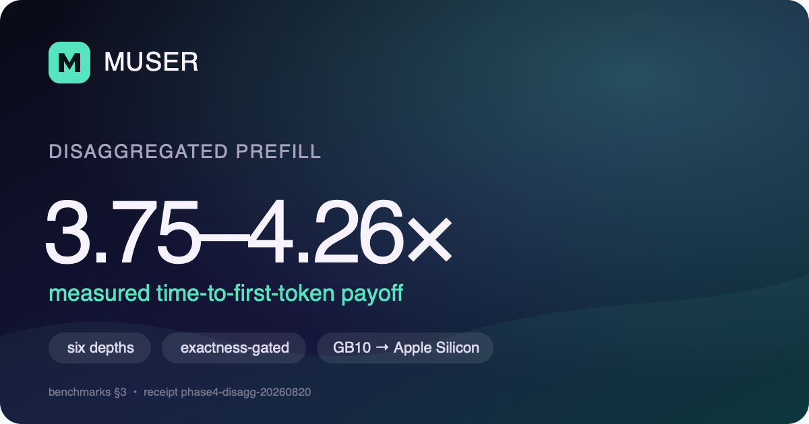
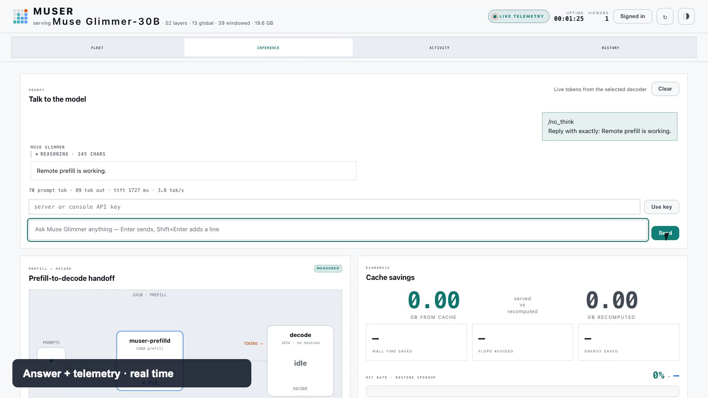

# muser

**A standalone inference engine for Muse Glimmer (52-layer, ~30B) on Apple
Silicon — with an optional disaggregated lane where an NVIDIA GB10-class node
prefills in NVFP4 and hands the KV cache to your Mac over an authenticated
transport.**

Muser is independent and is not affiliated with, sponsored by, or endorsed by
Meta or the Muse model authors.



## Watch it work

[](docs/assets/muser-onboarding-and-remote-prefill.mp4)

**[▶ Watch the 48-second onboarding and remote-prefill demo](docs/assets/muser-onboarding-and-remote-prefill.mp4)**

This is a real, privacy-masked console capture: one-field node enrollment,
visible vLLM startup milestones, an authenticated NVFP4 prefill handoff, Metal
decode, and measured telemetry. Accelerated sections are labeled on screen;
the final answer and telemetry are shown in real time.

## The three numbers that matter

All ratios are **llama.cpp ÷ muser** against a source-pinned llama.cpp
comparator, exact-token matched on every rep — higher is better. Full tables,
methodology, and evidence receipts: [`docs/benchmarks.md`](docs/benchmarks.md).

**1. On muser's exact-token benchmark suite, muser matches or beats the
pinned llama.cpp at every tested depth — with or without speculation.**

| Prompt depth | Plain decode | Plain prefill | DFlash spec decode | Spec wall |
|---:|---:|---:|---:|---:|
| 2,048 | 1.050× | 1.040× | 1.237× | 1.071× |
| 8,192 | 1.043× | 1.021× | 1.214׆ | 1.022׆ |
| 32,768 | 1.048× | 1.017× | 1.196× | 1.007× |
| 65,536 | 1.027× | 1.016× | 1.188׆ | 1.006׆ |
| 131,008 | 1.028× | 1.014× | — | **1.025×** |

Five-rep means on synthetic exact-token fixtures; † marks single-rep
diagnostic cells. The one place the edge flips is disclosed too: on natural
text, DFlash wins on code-like content (1.19–1.32×) and llama's lighter
draft keeps high-acceptance shallow text at 2,048 (0.945×) —
[`docs/benchmarks.md`](docs/benchmarks.md) publishes both sides.

**2. Disaggregated prefill cuts time-to-first-token 3.75–4.26× versus
prefilling locally on the Mac.**

| Prompt depth | Local TTFT | GB10 NVFP4 TTFT | Payoff |
|---:|---:|---:|---:|
| 2,048 | 6.48 s | 1.52 s | **4.26×** |
| 32,768 | 114.3 s | 30.5 s | **3.75×** |
| 130,815 | 570.1 s | 137.4 s | **4.15×** |

Every rep is deterministic and checked against the local reference lane; the
handoff is authenticated TLS + HMAC sustaining ~7 Gbps of installed payload
at the deepest cell (wired link, EEE off — measured production guidance).
Bringing a producer online is one command — `muser node add <user@host>` or
the dashboard's **Add node** — running preflight, pinned deploy, model
verification, key enrollment, and one bounded authenticated handoff before a
node is called healthy. `muser node qualify <name>` runs the separate
three-repetition local-reference evidence cell:
[`docs/disaggregated-prefill.md`](docs/disaggregated-prefill.md),
[`docs/one-button-onboarding.md`](docs/one-button-onboarding.md).

**3. kvpack — exact KV state, moved safely. Exactness is the product; speed
is the consequence.**

The reuse ladder, all measured with retained receipts:

- **One Mac:** a warm local prefix resumes in **~65 ms**.
- **With a producer:** a warm 65k/131k prefix answers in **0.61 s / 1.06 s**
  (vs 68.6 s / 147.8 s cold), bit-identical output.
- **Half the prompt cached:** a delta handoff moves **54.2851%** of the bytes
  for an output SHA-256 *exactly equal* to a full handoff's.

A miss through the same path stays slow (~12.9 s) — measured reuse, not
cache-forever.

Safety is mechanical, not conventional: keyed eight-field identity (any
tokenizer/template/quant/ABI difference is a rejection, never a best-effort
restore), Merkle-sealed immutable packs with crash-safe publication, a
replay ledger, mutual TLS + HMAC-sealed manifests, bounded abortable
restore, and a fail-closed producer that refuses to serve suspect state.
The refusals themselves are proven live on real hardware — stale
generations, foreign identities, and tampered manifests each produce
retained rejection receipts. Full model: [`docs/kvpack.md`](docs/kvpack.md).

## Quickstart

For the signed Apple Silicon release, verify and open the `.dmg`, then
double-click **Muser.app**. The signed app opens a visible Terminal and runs the
same `muser up` flow documented in [`docs/install.md`](docs/install.md).

From a source clone, build the two binaries used by onboarding:

```sh
git clone https://github.com/High-Performance-AI-Lab/muser.git && cd muser
cargo build --release --locked -p muser-server --bin muser
cargo build --release --locked -p muser-bench --bin muser-remote-qualify --features metal

# Opens the local dashboard. On a fresh install, choose Add node and enter
# user@host. The same process becomes the inference server when setup passes;
# use the Inference tab to send a prompt and watch the handoff live.
./target/release/muser up
```

There is no setup-server restart. **Add node** downloads and verifies the
native Mac artifact, deploys the pinned GX10 dependency image plus the release
runtime overlay, provisions mTLS/HMAC, proves a real KV install and Metal
decode, then starts the Mac decoder on the already-open listener. Subsequent
bare `muser up` launches select the newest compatible healthy NVFP4 enrollment
automatically and preserve the supervised producer across Mac restarts.
`muser node add user@host` is the headless equivalent; `up --node <name>` is
only needed to choose among multiple enrollments. Full three-repetition
correctness evidence remains the explicit maintainer command
`muser node qualify <name>`.

Enrollment copies the validated producer-identity manifest into the node's
private `~/.muser/nodes/<name>/` state before publishing the registry entry.
The topology therefore does not retain a dependency on the source checkout,
an extracted archive, or a mounted installer path. A repeat Add Node also
migrates older transient receipt paths while preserving a healthy warm
producer.

First install needs 48 GiB free on the selected Mac model volume. The 19.6 GB
artifact is split into independently hashed release chunks;
completed chunks survive a retry, and the assembled file is published only
after its final SHA-256 matches. The 7 MB source-pinned Metal runtime is also
resolved automatically. If an anonymous container-registry pull is
unavailable, deployment falls back to an equally pinned public image archive
and still requires the exact Docker image ID.

After downloads and verification, a genuinely cold producer still loads the
checkpoint, initializes CUDA/vLLM, allocates KV, and warms the first request.
The current runtime preserves the 131,072-token contract but initializes an
8,192-token scheduler shape; the qualified chunked-prefill connector exports
only the final complete KV state for longer prompts. On the tested GX10, the
full cold daemon reached ready in **187 seconds**: weights finished at 108
seconds, KV/kernel warmup began at 115, and first-request warmup began at 153.
Muser already supplies an explicit KV budget and disables optional JIT/CuteDSL
warmups. There is no safe vLLM switch that skips the remaining weight load,
engine initialization, KV allocation, and real warmup while producing a ready
engine with the same serving contract. Final cold receipts for this runtime
were **187–206 seconds**: the qualified run reached ready at 187 seconds, the
clean public-bundle runs at 199 and 206, and the final canonical restore at
189. The spread is real filesystem/cache variance, not hidden setup work.

The Add Node console presents this as five milestones: engine setup, weight
loading, 8K chunk initialization, 128K KV allocation, and first-request
warmup. The active segment remains animated, its elapsed clock keeps moving,
and Muser emits a sanitized heartbeat every 15 seconds. This is a milestone
bar rather than a fabricated time percentage. Raw container logs are not sent
to the browser. Re-adding a matching healthy node keeps the producer warm;
`--repair` is the explicit redeploy/restart path. The Mac-only kquant research
lane remains available as `muser up --local`; it is not the shipped default.

Then use any OpenAI-compatible client at `http://127.0.0.1:4949`:

```sh
curl http://127.0.0.1:4949/v1/chat/completions \
  -H 'Content-Type: application/json' \
  -d '{"messages":[{"role":"user","content":"Reply with exactly: Remote prefill is working."}],"max_tokens":256}'
```

Muse Glimmer emits reasoning separately from final content. Keep enough output
budget for both; forcing greedy `temperature: 0` can produce repetitive
reasoning on this checkpoint.

llama.cpp-compatible (`/completion`, `/slots`, `/props`, …) and Ollama-style
routes are implemented too; unknown fields are rejected rather than ignored.

DFlash speculation (`--dflash`), remote prefill (`--prefill remote`), TLS and
multi-machine setup: [`docs/quickstart.md`](docs/quickstart.md).

## What's inside

```text
crates/muser-engine/   Muse topology, GGUF/quants, CPU + Metal engine
crates/muser-server/   CLI, strict APIs, sessions/migration, TLS/auth, telemetry
crates/muser-kvpack/   resident radix + authenticated durable KV adapter
crates/muser-cluster/  authenticated atomic GX10 handoff consumer
crates/muser-bench/    benchmark executor, route fingerprints, remote qualifier
```

- **Metal decode for Muse Glimmer** on Apple Silicon, with llama.cpp
  source-pinned serving parity — exact tokens, logprobs, embeddings, slots,
  and resumable streams, verified by a live differential against a frozen
  route-by-route compatibility contract
  ([`release/llama-server-compat-v1.json`](release/llama-server-compat-v1.json)).
- **DFlash speculative decoding** (kquant draft lane): exact-token verified
  against llama.cpp's own draft-dflash route; serving verify-length frozen at
  7 from measured natural-text evidence.
- **The disaggregated lane**: producer and consumer are roles — the process
  that prefills and the process that decodes — connected by kvpack over
  authenticated TLS + HMAC-sealed manifests with a replay ledger. Today's
  qualified placement is a GB10-class NVIDIA producer and your Mac decoding
  (one of each); the role split itself is host-agnostic, and scale-out is
  roadmap.
- **Sessions and telemetry done honestly**: encrypted session bundles,
  Prometheus metrics, and a live dashboard where every number carries a
  `measured`/`target`/`mock` honesty tag.
- **Local vision** (image input) works; remote-multimodal prefill is not yet
  qualified and falls back to local prefill.

## Correctness culture

- Every performance number above is receipted, not projected: comparator
  cells are exact-token means (five reps unless a cell is marked single-rep);
  the reuse and delta effects are measured packets with retained verdicts.
  Public methodology is summarized in
  [`docs/benchmarks.md`](docs/benchmarks.md), and release wording is governed
  by [`docs/launch-claims.md`](docs/launch-claims.md).
- An 8/8 deep-payload soak (130,815-token handoffs, back to back) ran with
  zero producer deaths and deterministic output.
- Speculative decoding *across the wire* was measured and **rejected** — the
  remote verifier cost eats the gain. We publish the result:
  [`docs/nvfp4-distributed-speculative-frontier-20260818.md`](docs/nvfp4-distributed-speculative-frontier-20260818.md).
- The vendored kvpack snapshot under `third_party/kvpack` is hash-pinned with
  recorded provenance: `python3 scripts/audit_vendored_kvpack.py`.

## Build and test

```sh
cargo test --workspace --no-default-features    # CPU-safe suite
python3 -m unittest discover -s scripts/tests   # Python suite
cargo clippy --workspace --all-targets -- -D warnings
cargo fmt --check
```

Metal serving resolves the SHA-pinned llama.cpp metallib and source receipt on
first use; `MUSER_GGML_METALLIB` can override the location but not the pinned
identity. `--no-default-features` gives a CPU-only correctness path. Anything
touching the GPU in this repo's lab runs through
`scripts/accelerator_safe.py` (dry-run by default, `--execute` to run).

## Documentation

| Doc | What it covers |
|---|---|
| [`docs/quickstart.md`](docs/quickstart.md) | Build, serve, speculate, go disaggregated |
| [`docs/benchmarks.md`](docs/benchmarks.md) | Every number, its methodology, and its receipt |
| [`docs/disaggregated-prefill.md`](docs/disaggregated-prefill.md) | The GB10→Mac lane: why, how, numbers, operations |
| [`docs/kvpack.md`](docs/kvpack.md) | The KV handoff format and its security properties |
| [`docs/muser-architecture.md`](docs/muser-architecture.md) | Engine internals |
| [`docs/one-button-onboarding.md`](docs/one-button-onboarding.md) | Node onboarding, step by step |
| [`docs/onboarding-readiness.md`](docs/onboarding-readiness.md) | Onboarding risks, closed behavior, and release evidence |
| [`docs/telemetry.md`](docs/telemetry.md) | Metrics and the honesty-tagged dashboard |

## Status and license

Beta: version `0.1.0-beta.1`, single-model by design (Muse Glimmer), macOS
+ Apple Silicon decode, one GX10-class producer for the disaggregated lane.
Expect rough edges; expect the numbers above to be real and receipted.

Dual-licensed under [`Apache-2.0 OR MIT`](LICENSE-MIT). Extracted code retains
its source license and is identified in [`NOTICE`](NOTICE). Model weights are
not stored in Git. The separately checksummed native NVFP4 consumer artifact
derives from the Apache-2.0 Muse Glimmer model and is distributed through the
pinned release named by the onboarding identity.
